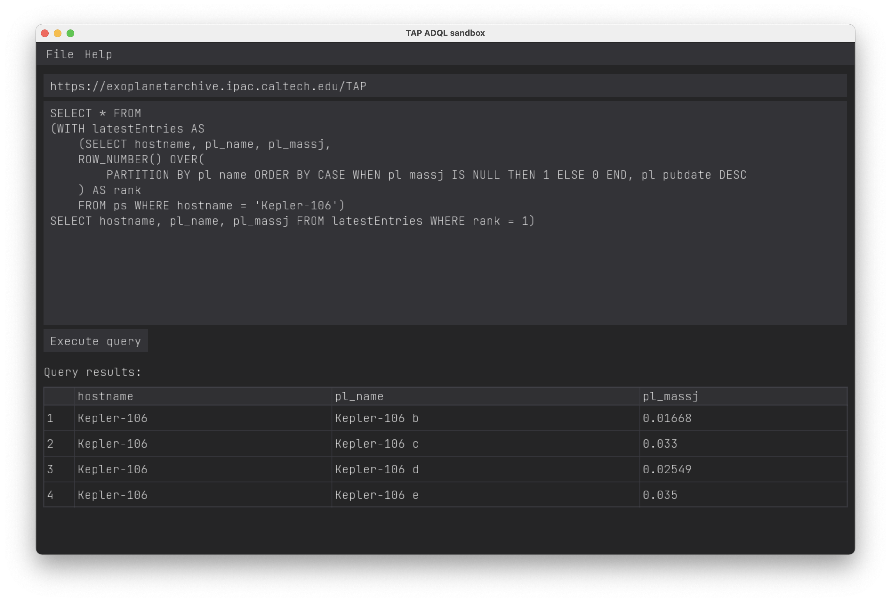

# TAP ADQL sandbox

<!-- MarkdownTOC -->

- [About](#about)
- [Platforms](#platforms)
- [3rd-party](#3rd-party)
    - [Requirements](#requirements)
    - [Resources](#resources)

<!-- /MarkdownTOC -->

## About

A sandbox application for executing ADQL queries via TAP interface of various data sources, such as astronomical databases. Essentially, it's just a GUI for [PyVO](https://pypi.org/project/pyvo/).

## Platforms

Tested on:

- Mac OS:
    + 11.6.2, Intel
- Windows:
    + 10
    + 11
- GNU/Linux:
    + Ubuntu 20.04

## 3rd-party

### Requirements

- Python 3.6 or later (*though the oldest tested version is 3.7*)
- [DearPyGui](https://pypi.org/project/dearpygui/)
- [PyVO](https://pypi.org/project/pyvo/)
- [pandas](https://pypi.org/project/pandas/)

### Resources

- [JetBrains Mono](https://www.jetbrains.com/lp/mono/) font
- [an icon](/src/tap-adql-sandbox/icons) of unknown origin
